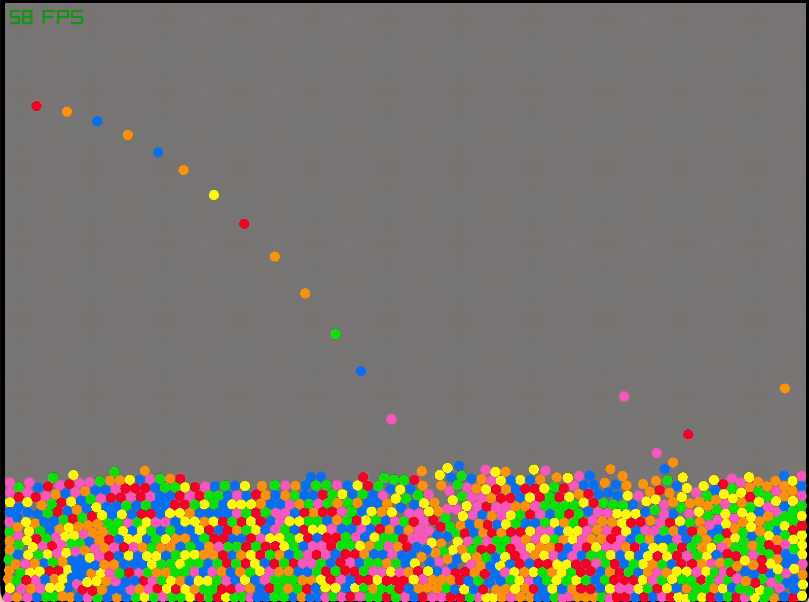

# physics
## description
this is a particle collision simulation i worked on starting in december 2024. I implemented spatial partitioning make the thing run better at higher number of particles. not rlly sure what the limit is for particles but it works at 60fps on my mac m1 for 100k particles.

## running it

1. Clone the repo

2. make sure you have raylib (graphics library) installed
```bash
brew install raylib
```
if you're on mac, idk what to do if you're on windows

3. make sure the `CMakeLists.txt` points to where the raylib header is located (`raylib.h`, in my case its in `/opt/homebrew/include`) and where the dynamic link library is located (in my case its `/opt/homebrew/lib`). The header exposes to your C code the functions you have access to while the `.dylib` files in in `/opt/homebrew/lib` contain the actual compiled implementations of those functions which are used at runtime.

5. Create a `build/` directory.
```bash
mkdir build
```

6. Run `cmake` in the build directory but targeting the project root
```bash
cmake .. # from inside build/
```
7. Build the source code into a binary using make from inside the `build/` directory.
```bash
make # from inside build/
```

8. Run the compile binary from inside `build/`
```bash
./physics # from inside build/
```

## simulation gif!

